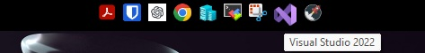
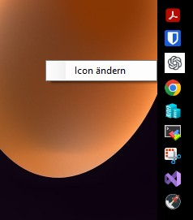
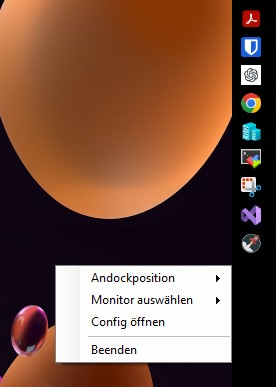

# LinkbarNET

LinkbarNET ist eine schlanke, anpassbare **App-Bar für Windows**, die als Schnellstartleiste für Programme dient. Sie kann an einer beliebigen Bildschirmseite angedockt werden und zeigt Icons von Programmen aus einem konfigurierbaren Ordner. Zusätzlich unterstützt sie **mehrere Monitore**, speichert die letzte Position und Konfiguration und bietet ein Kontextmenü zur Anpassung der Einstellungen.

## 🚀 Funktionen

- ✅ **Dockbar**: Kann an **oben, unten, links oder rechts** positioniert werden  
- ✅ **Shortcut-Verwaltung**: Lädt `.lnk`-Dateien aus einem konfigurierbaren Ordner  
- ✅ **Mehrmonitor-Unterstützung**: Auswahl des Monitors per Rechtsklick  
- ✅ **Einstellungen speichern**: Position, Monitor und Shortcut-Ordner werden persistiert  
- ✅ **Tooltips**: Zeigt den Namen der Programme beim Hovern über das Icon  
- ✅ **Automatische Neuladung**: Aktualisiert die Verknüpfungen automatisch  

## 📸 Screenshots

### Hauptansicht  
  

### Einstellungen  
  

### Mehrmonitor-Unterstützung  
  

## 🔧 Installation

### 1️⃣ Voraussetzungen
- **Windows 10 / 11**
- **.NET Framework 4.8** oder **.NET 6** (je nach Build)
- **Visual Studio** (für Anpassungen und Build)

### 2️⃣ Kompilieren & Ausführen
1. **Repository klonen**
   ```sh
   git clone https://github.com/mrbrighter/LinkbarNET.git
   cd linkbarnet
   ```
2. **Projekt in Visual Studio öffnen**
3. **Build ausführen** (Release-Modus empfohlen)
4. **`LinkbarNET.exe` starten**

## ⚙️ Konfiguration

Die Konfigurationsdatei befindet sich in:
```
C:\Users\%USERNAME%\AppData\Roaming\LinkbarNET\settings.json
```

### Beispiel `settings.json`
```json
{
  "DockPosition": "Top",
  "MonitorDeviceName": "\\\\.\\DISPLAY1",
  "ShortcutPath": "C:\\shortcuts",
  "CustomIconMapping": {}
}
```

| Schlüssel             | Beschreibung                                       |
|-----------------------|----------------------------------------------------|
| `DockPosition`        | `Top`, `Bottom`, `Left`, `Right` (Andockposition)   |
| `MonitorDeviceName`   | Name des Monitors (wird automatisch erkannt)       |
| `ShortcutPath`        | Ordner mit den `.lnk`-Dateien                       |
| `CustomIconMapping`   | Mapping von Shortcut-Dateien zu benutzerdefinierten Icons |

## 📖 Nutzung

1. **Rechtsklick auf die Leiste** → Kontextmenü erscheint  
2. **Monitor wechseln** → Menü „Monitor auswählen“  
3. **Dock-Position ändern** → Menü „Andockposition“  
4. **Verknüpfungen aktualisieren** → Automatische Aktualisierung alle 60 Sekunden  
5. **Beenden** → Kontextmenü „Beenden“

### Icon-Anpassung

- **Icon ändern:**  
  Rechtsklick auf ein Icon → „Icon ändern“ auswählen und eine `.ico`-Datei wählen.
  
- **Icon löschen:**  
  Falls ein benutzerdefiniertes Icon gesetzt wurde, erscheint zusätzlich der Menüpunkt „Icon löschen“. Dieser entfernt den Eintrag aus der `settings.json` und setzt das Standard-Icon wieder ein.

## 🛠 Bekannte Probleme

- Falls das **Kontextmenü auf dem falschen Monitor erscheint**, passe in `Panel_MouseUp()` das `ToolStripDropDownDirection` an.
- Falls sich **Icons nicht aktualisieren**, prüfe bitte, ob im Shortcut-Ordner korrekte `.lnk`-Dateien vorhanden sind.

## 📝 Lizenz

Dieses Projekt steht unter der **MIT-Lizenz**.  
Siehe [LICENSE](LICENSE) für weitere Details.

---

## 📥 Download

Du kannst die aktuellste Version direkt von [GitLab Releases](https://github.com/mrbrighter/LinkbarNET/releases) herunterladen.
